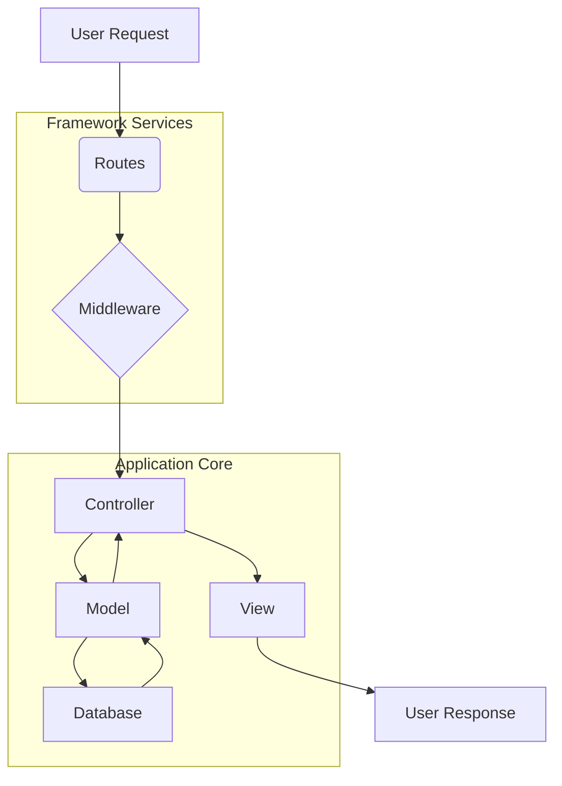

# CodeViz Research Context

> **Note**: This file contains research context from CodeViz. Most recent contexts are at the bottom.

---

## Research Query

Show the complete diagram

*Session: 791cfb67e908f3205978a77d91c20807 | Generated: 7/8/2025, 10:26:36 AM*

### Analysis Summary

# Codebase Diagram: Charros Sport Bar Application

This report provides a comprehensive overview of the Charros Sport Bar application's codebase, detailing its high-level architecture, key components, and their interrelationships. The application is built using the Laravel framework, following its established conventions for structuring web applications.

## High-Level Architecture

The application follows a Model-View-Controller (MVC) architectural pattern, typical for Laravel applications.

*   **HTTP Layer**: Handles incoming requests, routing them to appropriate controllers.
*   **Business Logic (Controllers & Models)**: Controllers process requests and interact with models, which encapsulate the application's data and business rules.
*   **Data Persistence (Database)**: Stores application data, managed through migrations and models.
*   **Presentation Layer (Views)**: Renders the user interface based on data provided by controllers.
*   **Routing**: Defines the application's endpoints and maps them to controller actions.
*   **Services & Providers**: Bootstrap the application, register services, and handle event management.

## Core Components

### HTTP Layer

The HTTP layer is responsible for handling incoming web requests and returning responses. It comprises controllers, middleware, and form requests.

*   **Controllers**: Process incoming requests, interact with models, and prepare data for views.
    *   [AreaXGamesController](app/Http/Controllers/AreaXGamesController.php)
    *   [BusinessDayController](app/Http/Controllers/BusinessDayController.php)
    *   [ContactoController](app/Http/Controllers/ContactoController.php)
    *   [DashboardController](app/Http/Controllers/DashboardController.php)
    *   [PaymentController](app/Http/Controllers/PaymentController.php)
    *   [ReservationController](app/Http/Controllers/ReservationController.php)
    *   [UserController](app/Http/Controllers/UserController.php)
*   **Middleware**: Filters HTTP requests entering the application. Examples include authentication, CSRF protection, and role-based access control.
    *   [CheckUserRole](app/Http/Middleware/CheckUserRole.php)
*   **Requests**: Custom request classes for validation and authorization of incoming data.
    *   [StoreBusinessDayRequest](app/Http/Requests/StoreBusinessDayRequest.php)

### Models

Models represent the data structures and business logic related to the database. Each model typically corresponds to a database table.

*   [Area](app/Models/Area.php)
*   [AreaXGame](app/Models/AreaXGame.php)
*   [BusinessDay](app/Models/BusinessDay.php)
*   [Payment](app/Models/Payment.php)
*   [Reservation](app/Models/Reservation.php)
*   [User](app/Models/User.php)

### Database

The database component manages the application's data persistence.

*   **Migrations**: Define the database schema and allow for version control of the database.
    *   [create_users_table](database/migrations/0001_01_01_000000_create_users_table.php)
    *   [create_business_days_table](database/migrations/2025_03_27_224114_create_business_days_table.php)
    *   [create_areas_table](database/migrations/2025_04_04_174050_create_areas_table.php)
    *   [create_reservations_table](database/migrations/2025_04_08_182017_create_reservations_table.php)
*   **Seeders**: Populate the database with initial data.
    *   [DatabaseSeeder](database/seeders/DatabaseSeeder.php)
    *   [AreaSeeder](database/seeders/AreaSeeder.php)
    *   [BusinessDaySeeder](database/seeders/BusinessDaySeeder.php)
    *   [RolesTableSeeder](database/seeders/RolesTableSeeder.php)

### Views

Views are responsible for rendering the HTML that is served to the user. They are typically Blade templates.

*   [checkout](resources/views/checkout.blade.php)
*   [contacto](resources/views/contacto.blade.php)
*   [dashboard](resources/views/dashboard.blade.php)
*   [index](resources/views/index.blade.php)
*   [menu](resources/views/menu.blade.php)
*   [reserva](resources/views/reserva.blade.php)
*   [welcome](resources/views/welcome.blade.php)
*   **Layouts**: Define the overall structure of the application's pages.
    *   [AppLayout](app/View/Components/AppLayout.php) (component)
    *   [GuestLayout](app/View/Components/GuestLayout.php) (component)

### Routing

Routes define the entry points for the application, mapping URLs to controller actions or closures.

*   **Web Routes**: Handle web-based requests, typically with session state and CSRF protection.
    *   [web.php](routes/web.php)
*   **API Routes**: Handle API requests, often stateless and authenticated via tokens.
    *   [api.php](routes/api.php)

### Services and Providers

Service Providers are the central place for all Laravel application bootstrapping. They bind services into the service container, register event listeners, and more.

*   [AppServiceProvider](app/Providers/AppServiceProvider.php)
*   [EventServiceProvider](app/Providers/EventServiceProvider.php)
*   [FortifyServiceProvider](app/Providers/FortifyServiceProvider.php)
*   [JetstreamServiceProvider](app/Providers/JetstreamServiceProvider.php)

### Authentication and User Management (Fortify & Jetstream)

The application leverages Laravel Fortify and Jetstream for authentication, user registration, password management, and other security features.

*   **Fortify Actions**: Custom actions for user management.
    *   [CreateNewUser](app/Actions/Fortify/CreateNewUser.php)
    *   [UpdateUserPassword](app/Actions/Fortify/UpdateUserPassword.php)
    *   [UpdateUserProfileInformation](app/Actions/Fortify/UpdateUserProfileInformation.php)
*   **Jetstream Actions**: Actions specific to Jetstream features.
    *   [DeleteUser](app/Actions/Jetstream/DeleteUser.php)

### Mail

Handles sending emails for various application events.

*   [ContactoMail](app/Mail/ContactoMail.php)
*   [ReservationSuccessMail](app/Mail/ReservationSuccessMail.php)

### Policies

Policies define authorization logic for models and resources.

*   [BusinessDayPolicy](app/Policies/BusinessDayPolicy.php)

### Observers

Observers allow you to group listeners for a given model.

*   [BusinessDayObserver](app/Observers/BusinessDayObserver.php)

---

## Research Query

Show the reservation/payment process

*Session: f4ad00a331555c603fbc19ceae757155 | Generated: 7/8/2025, 10:27:56 AM*

### Analysis Summary

# Reservation and Payment Process

The reservation and payment process in this application involves several key components, including controllers, models, requests, and views, orchestrating the flow from user reservation request to payment processing and confirmation.

## High-Level Architecture

The overall process can be conceptualized as a user interacting with the frontend (Blade templates), which sends requests to **Laravel Controllers**. These controllers then interact with **Models** for data persistence and business logic, potentially involving external payment gateways. **Mailers** are used for notifications.

## Mid-Level Components and Interactions

### **1. Reservation Flow**

The reservation flow typically starts with a user selecting a date and time, submitting reservation details, and then proceeding to payment.

#### **1.1 Frontend Interaction**

Users interact with the reservation form, likely rendered by the [reserva.blade.php](resources/views/reserva.blade.php) view. This view probably uses JavaScript (e.g., [reserva.js](public/js/reserva.js)) to handle dynamic elements and form submission.

#### **1.2 Reservation Controller**

The [ReservationController](app/Http/Controllers/ReservationController.php) handles the backend logic for creating, managing, and potentially displaying reservations.

*   **Purpose:** Manages the lifecycle of reservations, from creation to display.
*   **Internal Parts:** Contains methods for storing new reservations, showing reservation details, and potentially updating or deleting them.
*   **External Relationships:** Interacts with the [Reservation Model](app/Models/Reservation.php) for database operations and potentially with the [BusinessDayController](app/Http/Controllers/BusinessDayController.php) or [BusinessDay Model](app/Models/BusinessDay.php) to check availability. It also dispatches emails via [ReservationSuccessMail](app/Mail/ReservationSuccessMail.php).

#### **1.3 Reservation Model**

The [Reservation Model](app/Models/Reservation.php) represents the `reservations` table in the database.

*   **Purpose:** Defines the structure and behavior of reservation data.
*   **Internal Parts:** Attributes like `user_id`, `area_id`, `reservation_date`, `start_time`, `end_time`, `number_of_people`, `status`, and `total_amount`.
*   **External Relationships:** Belongs to a [User](app/Models/User.php) and an [Area](app/Models/Area.php). It might have a one-to-one relationship with a [Payment](app/Models/Payment.php). The database schema is defined in [create_reservations_table.php](database/migrations/2025_04_08_182017_create_reservations_table.php).

#### **1.4 Business Day Management**

The availability for reservations is likely managed through [BusinessDayController](app/Http/Controllers/BusinessDayController.php) and [BusinessDay Model](app/Models/BusinessDay.php).

*   **Purpose:** Manages the operational days and hours of the business, which directly impacts reservation availability.
*   **Internal Parts:** The [BusinessDay Model](app/Models/BusinessDay.php) has attributes like `date`, `is_open`, `opening_time`, `closing_time`. The database schema is in [create_business_days_table.php](database/migrations/2025_03_27_224114_create_business_days_table.php).
*   **External Relationships:** The [BusinessDayObserver](app/Observers/BusinessDayObserver.php) and [BusinessDayPolicy](app/Policies/BusinessDayPolicy.php) might be involved in enforcing business rules and authorization.

#### **1.5 Reservation Confirmation Email**

After a successful reservation, an email is sent to the user.

*   **Purpose:** Notifies the user about their reservation details.
*   **Internal Parts:** The [ReservationSuccessMail](app/Mail/ReservationSuccessMail.php) class constructs the email content.
*   **External Relationships:** Uses Laravel's Mail facade to send the email, likely triggered from the [ReservationController](app/Http/Controllers/ReservationController.php) after a reservation is saved.

### **2. Payment Flow**

The payment flow typically follows a successful reservation, where the user is redirected to a payment gateway or an internal payment processing page.

#### **2.1 Payment Controller**

The [PaymentController](app/Http/Controllers/PaymentController.php) is responsible for initiating and handling payment transactions.

*   **Purpose:** Manages the interaction with payment gateways and records payment status.
*   **Internal Parts:** Methods for creating payment requests, handling callbacks from payment gateways, and updating payment status.
*   **External Relationships:** Interacts with the [Payment Model](app/Models/Payment.php) for recording transactions. It might integrate with external payment services like Openpay, as suggested by [OpenpayRedirectController](app/Http/Controllers/OpenpayRedirectController.php).

#### **2.2 Openpay Redirect Controller**

The [OpenpayRedirectController](app/Http/Controllers/OpenpayRedirectController.php) specifically handles redirects and callbacks from the Openpay payment gateway.

*   **Purpose:** Acts as an intermediary for Openpay payment processing, handling the redirection to and from the Openpay platform.
*   **Internal Parts:** Methods to initiate the redirect and process the response from Openpay.
*   **External Relationships:** Communicates with the Openpay API and updates the payment status in the application, likely through the [Payment Model](app/Models/Payment.php).

#### **2.3 Payment Model**

The [Payment Model](app/Models/Payment.php) represents the `payments` or `transactions` table in the database.

*   **Purpose:** Stores details about payment transactions.
*   **Internal Parts:** Attributes like `reservation_id`, `amount`, `currency`, `status`, `transaction_id`, `payment_method`. The database schema is defined in [transactions.php](database/migrations/2025_06_24_221241_transactions.php).
*   **External Relationships:** Has a one-to-one relationship with a [Reservation](app/Models/Reservation.php).

#### **2.4 Checkout View**

The [checkout.blade.php](resources/views/checkout.blade.php) view is likely where the user is presented with payment options or redirected to a payment gateway.

*   **Purpose:** Provides the user interface for completing the payment.
*   **External Relationships:** Receives data from the [PaymentController](app/Http/Controllers/PaymentController.php) or [OpenpayRedirectController](app/Http/Controllers/OpenpayRedirectController.php) to display payment information or initiate the payment process.

## Low-Level Details

### **Routes**

The entry points for these processes are defined in the route files:

*   [web.php](routes/web.php): Contains web routes for user-facing pages and form submissions.
*   [api.php](routes/api.php): Might contain API routes for AJAX requests related to reservations or payments.

### **Database Migrations**

The database schemas for reservations and payments are defined in the following migration files:

*   [create_reservations_table.php](database/migrations/2025_04_08_182017_create_reservations_table.php)
*   [transactions.php](database/migrations/2025_06_24_221241_transactions.php)
*   [create_business_days_table.php](database/migrations/2025_03_27_224114_create_business_days_table.php)

### **Middleware**

*   [CheckUserRole.php](app/Http/Middleware/CheckUserRole.php): This middleware might be used to restrict access to certain reservation or payment functionalities based on the user's role.

### **Requests**

*   [StoreBusinessDayRequest.php](app/Http/Requests/StoreBusinessDayRequest.php): While not directly a reservation request, it's an example of how form validation is handled for related data. Similar request classes would exist for reservation and payment submissions.

